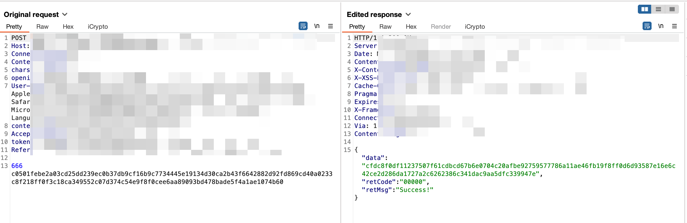
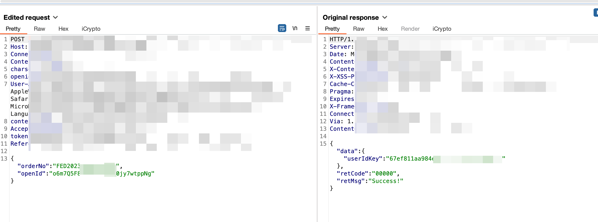
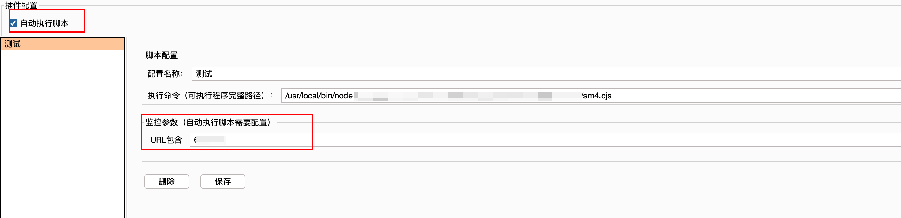
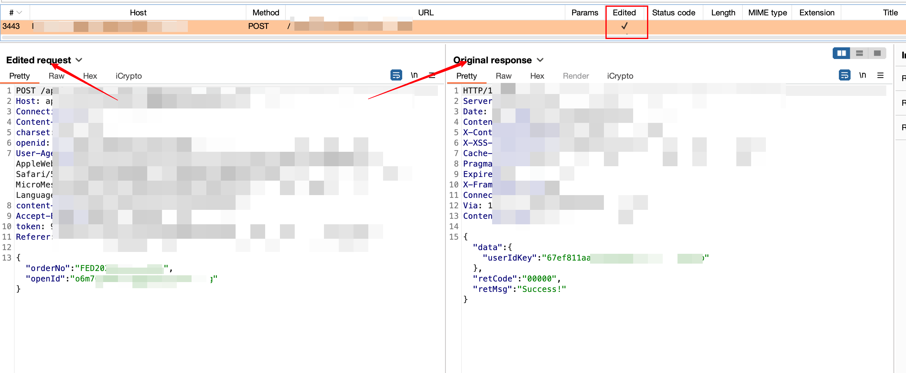
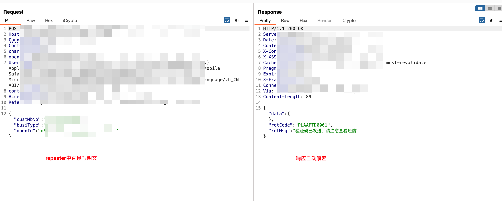
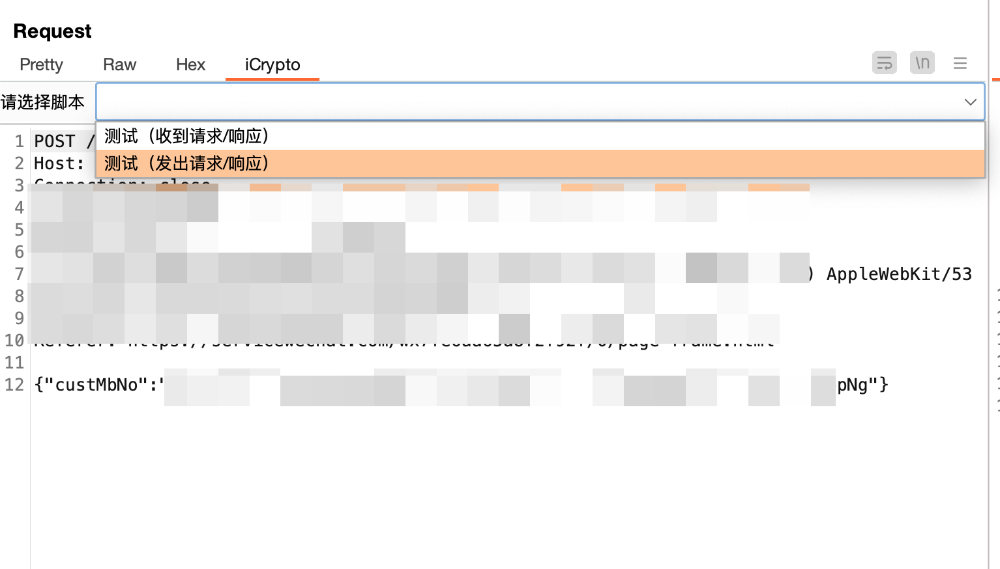
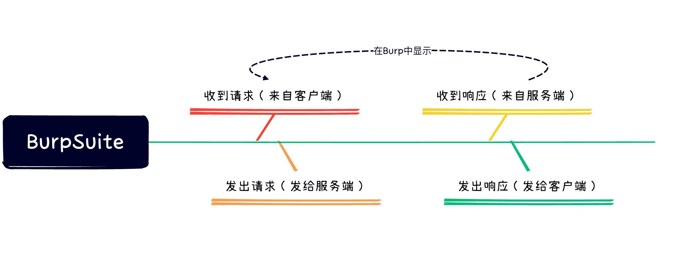

<p align="center">

</p>


## 项目简介

做一些app测试经常会遇到加密、签名的问题，这个插件可以帮助你进行重新签名、数据包解密、偷天换日...

| 解密前                                                       | 解密后                                                       |
| ------------------------------------------------------------ | ------------------------------------------------------------ |
|  |  |


## 使用

- 启用插件
- [编写你的脚本](#脚本编写指南)


### 自动加解密

只需勾上`自动执行脚本`，并在指定脚本添加监控URL即可（**只支持域名**)



自动加解密的结果可以在`History`、`Repeater`中查看






### 手动加解密
自动加解密可能存在一些性能问题，有时候可以尝试手动加解密：




## 脚本编写指南

插件调用脚本为：

```shell
执行命令 请求类型 临时文件夹
```

其中，第一个参数为 `请求类型`，一共有四种类型：

```js
const RequestFromClient = "0";// 日志/Interrupt收到请求（请求包解密）
const RequestToServer = "1";// Repeater/Interrupt发出请求（请求包加密）
const ResponseFromServer = "2";// 日志/Repeater/Interrupt收到响应（响应包解密）
const ResponseToClient = "3";// Repeater/Interrupt发出响应（响应包加密
```

可以根据burp的生命周期来理解这四种类型：



第二个参数为临时文件夹，数据如下：

| 名称                 | 解释                     | 举例                  | 在哪种请求下存在 |
| :------------------- | ------------------------ | --------------------- | ---------------- |
| body.txt             | 请求包的body部分         | id=1                  | Request/Response |
| headers.txt          | 请求包的headers部分      | Host: 127.0.0.1 等    | Request/Response |
| method.txt           | 请求包的请求方法         | GET                   | Request/Response |
| path.txt             | 请求包的请求路径         | /index.php            | Request/Response |
| version.txt          | 请求包使用的Http协议版本 | HTTP/2                | Request/Response |
| response_body.txt    | 响应包的body部分         | {"body":"sssss"}      | Response         |
| response_headers.txt | 响应包的headers部分      | Set-cookle: www=12333 | Response         |
| response_version.txt | 响应包的Http协议版本     | HTTP/2                | Response         |
| state.txt         | 响应包的响应代码         | 404                   | Response         |
| state_msg.txt    | 响应包的响应消息         | Not Found             |Response|

脚本在收到请求后，去修改对应临时文件夹的数据，处理成功，必须输出`success`字样

## 脚本调试指南

- 多关注`Extender`中`iCrypto`的`output`内容，如果脚本生效，则会在这里输出处理的请求包响应包等。
- 如果你发现脚本未生效，也可以复制`CustomCrypto`输出的命令内容，直接在命令行进行测试，以便于调试脚本。

## 案例&模板

- [Sm4](./examples/SM4加解密)

## 协议

MIT

